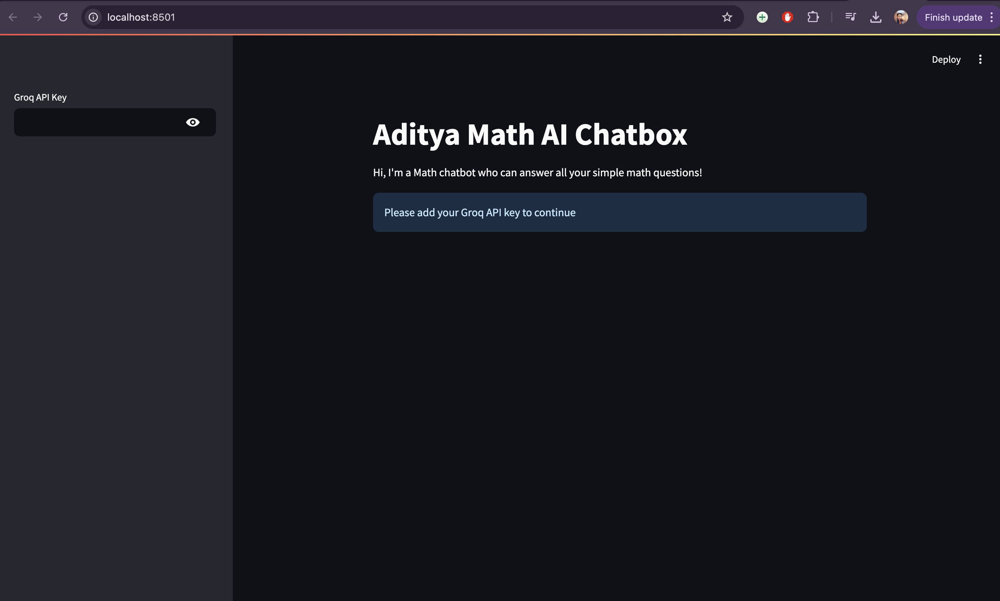
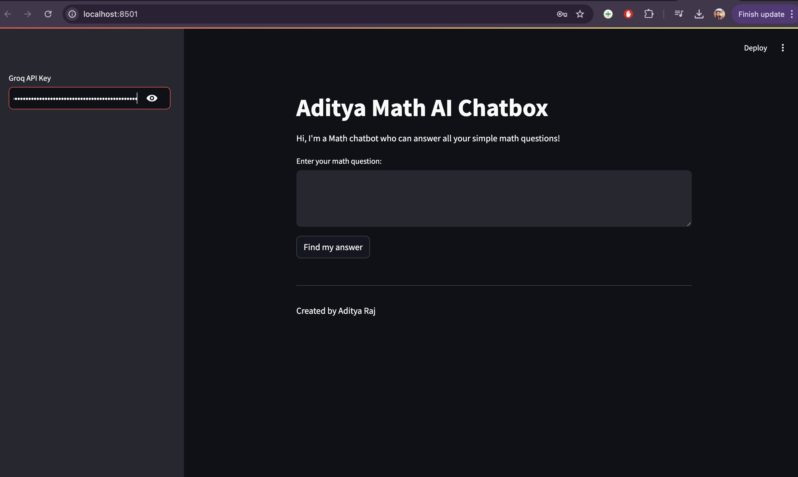

# Math-AI-Chatbot

**Math-AI-Chatbot** is a Streamlit-based chatbot that helps users solve simple math-related problems by dynamically processing questions and generating step-by-step solutions. It uses LangChain's Groq-powered `ChatGroq` model and integrates Wikipedia as a supplementary information source.

## Features

- **Solve Simple Math Problems**: Answer basic math questions and receive detailed, step-by-step explanations.
- **Logical Reasoning**: Answer logic-based and reasoning questions clearly and concisely.
- **Wikipedia Integration**: Look up related information for research or deeper understanding from Wikipedia.
- **Interactive UI**: Streamlined user interface that engages in conversational math solving.
- **Customizable**: Easy to extend with additional tools and models.

## Screenshots

Here are a few screenshots of the Math-AI-Chatbot in action:

- **SS1**: 
- **SS2**: 
- **SS3**: 

## Getting Started

Follow these steps to set up and run the Math-AI-Chatbot on your local machine:

### Prerequisites

You need the following installed on your system:

- Python 3.7 or higher
- Git
- A valid Groq API Key (available from [Groq](https://groq.com))

### Installation

1. **Clone the repository**:

   ```bash
   git clone https://github.com/imaadiiii/Math-AI-Chatbot.git
   cd Math-AI-Chatbot
   ```

2. **Create a virtual environment**:

   ```bash
   python3 -m venv venv
   source venv/bin/activate  # For Windows: venv\Scripts\activate
   ```

3. **Install the required dependencies**:

   ```bash
   pip install -r requirements.txt
   ```

4. **Add your Groq API Key**:

   - Launch the application and add your API key in the sidebar labeled **"Groq API Key"**.

### Running the Application

After installation, run the chatbot with the following command:

```bash
streamlit run app.py
```

This will start the Streamlit app in your browser, where you can interact with the Math-AI-Chatbot by asking math-related questions.

## Project Structure

```
Math-AI-Chatbot/
│
├── Screenshots/            # Screenshots of the app
│   ├── SS1.png
│   ├── SS2.png
│   └── SS3.png
│
├── app.py                  # Main application file
├── requirements.txt         # Required Python libraries
├── LICENSE                 # Project License (MIT)
└── README.md               # Project documentation
```

## Future Enhancements

My plan to enhance the Math-AI-Chatbot with the following features:

- **Advanced Math**: Enable support for algebra, calculus, and geometry.
- **Voice Input/Output**: Add voice-based interaction for ease of use.
- **Multilingual Support**: Allow queries in multiple languages.

## License

This project is licensed under the MIT License - see the [LICENSE](LICENSE) file for details.

---

Copy this into your `README.md` file, and your repository should be well-documented! Let me know if you need further adjustments.
